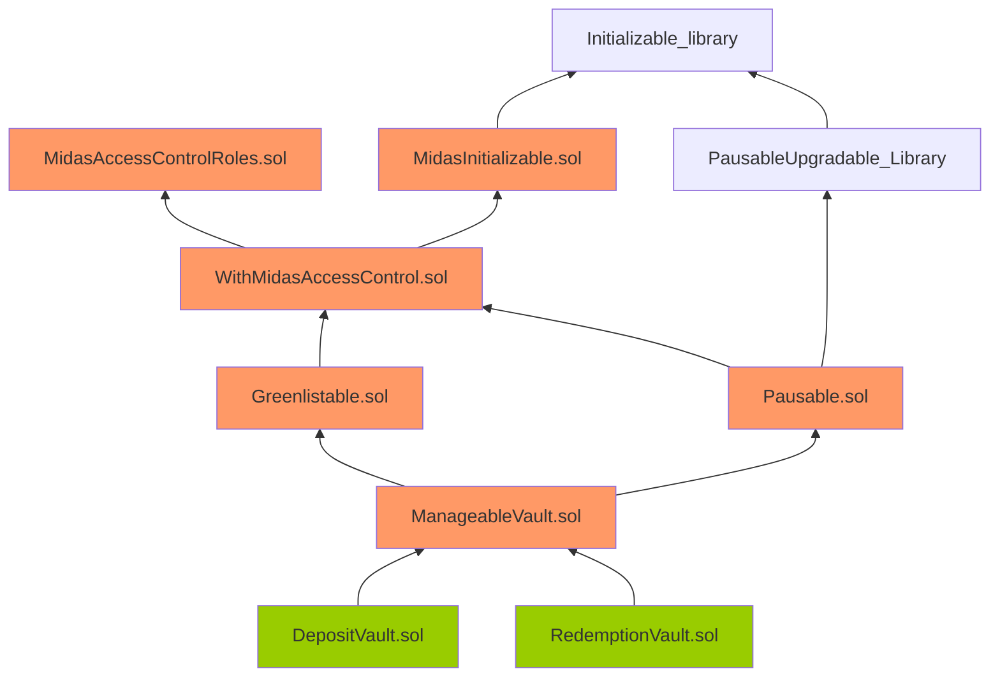

Slow Frost Cottonmouth

medium

# Corruptible Upgradability Pattern

## Summary

(Note: Report heavily inspired by this validated [sherlock report](https://github.com/sherlock-audit/2022-09-notional-judging/issues/64))

Storage of `DepositVault` and `RedemptionVault` vaults might get corrupted during an upgrade.

## Vulnerability Detail

This is the inheritance graph for the `DepositVault` and `RedemptionVault` contracts.

Note: The contracts highlighted in Orange mean that there are no gap slots defined. The contracts highlighted in Green mean that gap slots have been defined.



The `DepositVault` and `RedemptionVault` vaults are meant to be upgradeable. However, they inherit contracts that are not upgrade-safe.

The gap storage has been implemented on the `DepositVault` and `RedemptionVault` contracts:

```javascript
contract DepositVault is ManageableVault, IDepositVault {
    using EnumerableSet for EnumerableSet.AddressSet;
    using DecimalsCorrectionLibrary for uint256;
    using SafeERC20 for IERC20;
    using Counters for Counters.Counter;

    /**
     * @notice minimal USD amount in EUR for first user`s deposit
     */
    uint256 public minAmountToDepositInEuro;
    .
    .
    .
    /**
     * @dev leaving a storage gap for futures updates
     */
@>  uint256[50] private __gap;
```

```javascript
contract RedemptionVault is ManageableVault, IRedemptionVault {
    using EnumerableSet for EnumerableSet.AddressSet;
    using DecimalsCorrectionLibrary for uint256;
    using SafeERC20 for IERC20;
    using Counters for Counters.Counter;

    /**
     * @notice last redemption request id
     */
    Counters.Counter public lastRequestId;

    /**
     * @dev leaving a storage gap for futures updates
     */
@>  uint256[51] private __gap;
```

However, no gap storage has been implemented on the `ManageableVault`, `Pausable`, Greenlistable`, WithMidasAccessControl` and `MidasInitializable` contracts inherited by the `DepositVault` and `RedemptionVault` vaults.

Thus, adding new storage variables to any of these inherited contracts can potentially overwrite the beginning of the storage layout of the child contract. causing critical misbehaviors in the system.

## Impact

Storage of `DepositVault` and `RedemptionVault` vaults might be corrupted during upgrading, thus causing the vaults to be broken and assets to be stuck.

## Code Snippet

[https://github.com/sherlock-audit/2024-05-midas/blob/main/midas-contracts/contracts/DepositVault.sol#L60](https://github.com/sherlock-audit/2024-05-midas/blob/main/midas-contracts/contracts/DepositVault.sol#L60)
[https://github.com/sherlock-audit/2024-05-midas/blob/main/midas-contracts/contracts/RedemptionVault.sol#L40](https://github.com/sherlock-audit/2024-05-midas/blob/main/midas-contracts/contracts/RedemptionVault.sol#L40)

## Tool used

Manual Review

## Recommendation

Consider defining an appropriate storage gap in each upgradeable parent contract at the end of all the storage variable definitions as follows:

```diff
+ uint256[50] __gap; // gap to reserve storage in the contract for future variable additions
```
