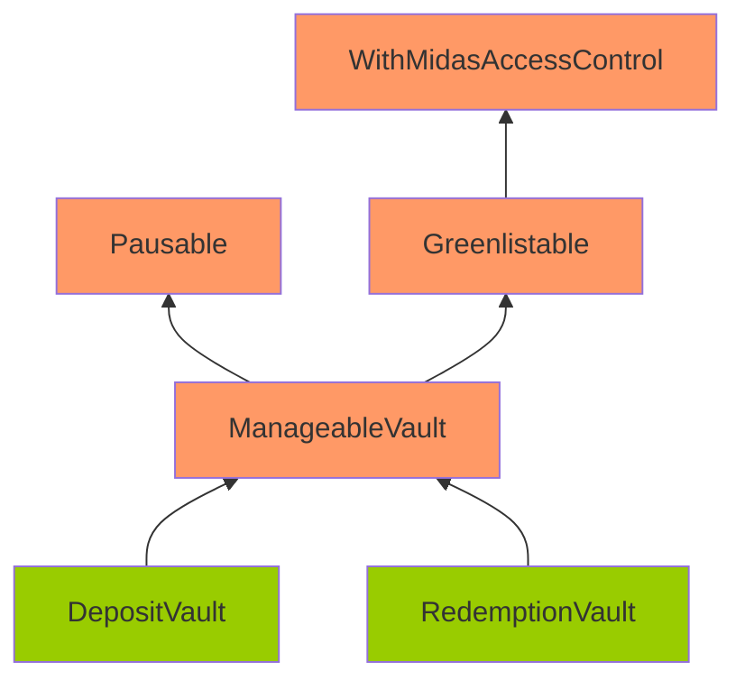
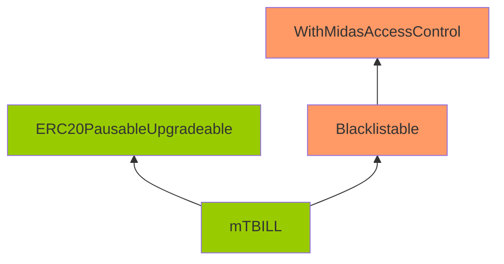

Lively Tiger Dragon

medium

# Corruptible Upgradability Pattern

## Summary

Storage of DepositVault/RedemptionVault/mTBILL contracts might be corrupted during an upgrade.

## Vulnerability Detail

Following are the inheritance of the DepositVault/RedemptionVault/mTBILL contracts.

Note: The contracts highlighted in Orange mean that there are no gap slots defined. The contracts highlighted in Green mean that gap slots have been defined

The DepositVault/RedemptionVault/mTBILL contracts are meant to be upgradeable. However, it inherits contracts that are not upgrade-safe.

The gap storage has been implemented on the DepositVault/RedemptionVault/mTBILL/ERC20PausableUpgradeable.

However, no gap storage is implemented on ManageableVault/Pausable/Greenlistable/Blacklistable/WithMidasAccessControl. Among these contracts, ManageableVault and WithMidasAccessControl are contracts with defined variables (non pure-function), and they should have gaps as well.

Without gaps, adding new storage variables to any of these contracts can potentially overwrite the beginning of the storage layout of the child contract, causing critical misbehaviors in the system.

## Impact

Storage of DepositVault/RedemptionVault/mTBILL contracts might be corrupted during upgrading.

## Code Snippet

- https://github.com/sherlock-audit/2024-05-midas/blob/main/midas-contracts/contracts/abstract/ManageableVault.sol#L24
- https://github.com/sherlock-audit/2024-05-midas/blob/main/midas-contracts/contracts/access/WithMidasAccessControl.sol#L12

## Tool used

Manual review

## Recommendation

Add gaps for non pure-function contracts: ManageableVault and WithMidasAccessControl.