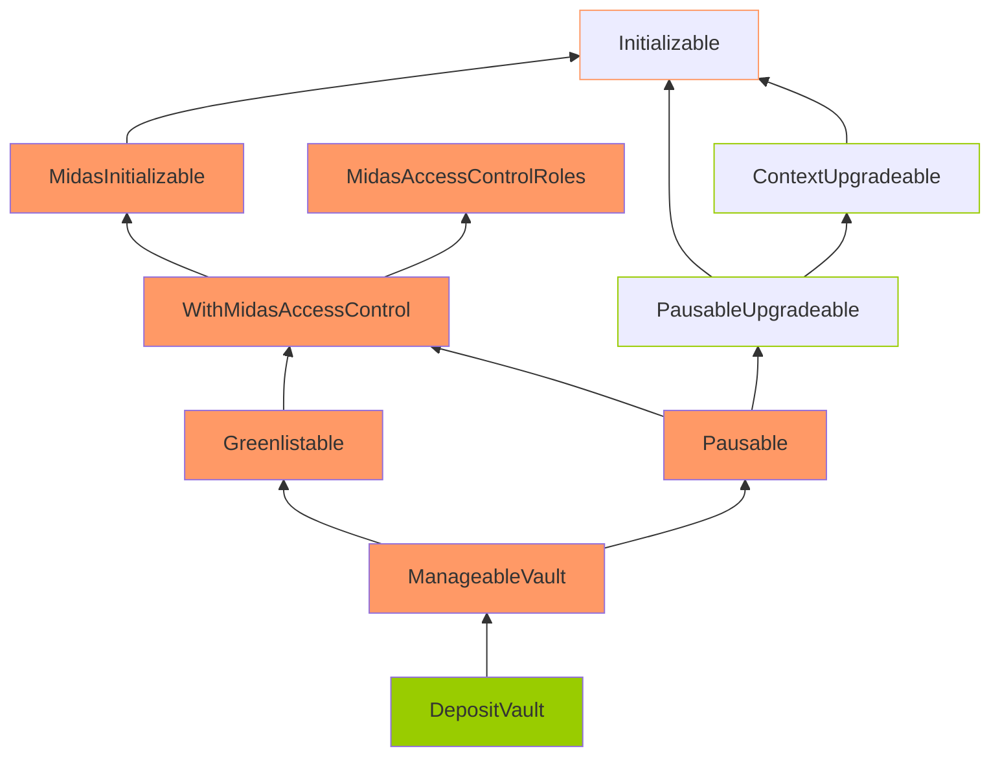
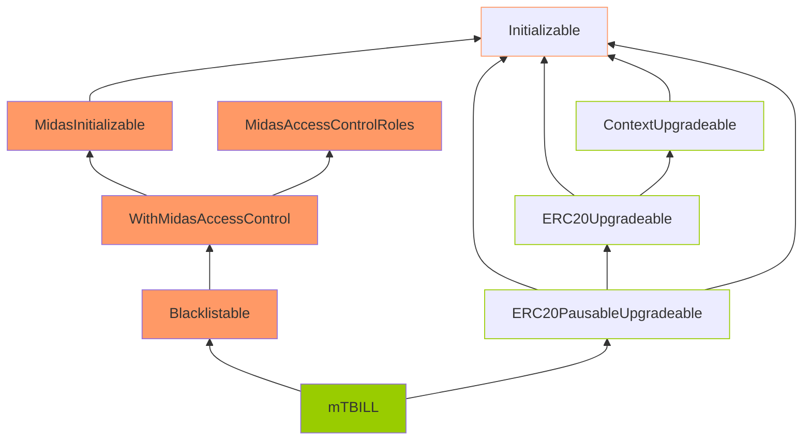

Loud Turquoise Yak

medium

# Contract Upgrade Pattern may be broken

## Summary

The storage layout in `DepositVault`, `RedemptionVault`, and `mTBILL` contracts may be at risk during upgrades.

## Vulnerability Detail

The `DepositVault`, `RedemptionVault`, and `mTBILL` contracts use the OpenZeppelin library version 4.9.x, which allows for upgrades and utilizes a storage layout with storage gaps. However, only the youngest children in the inheritance hierarchy use storage gaps.

Below is the inheritance structure:
- Green nodes include storage gaps
- Orange nodes do not include storage gaps
- Black nodes represent OpenZeppelin contracts with frame colors corresponding to the above

### DepositVault (RedemptionVault has a similar inheritance tree)



### mTBILL



This shows that the project implements OpenZeppelin contracts with inheritance, but the base contracts of the project, which contain most of the functionality needed for the proper functioning of the `DepositVault`, `RedemptionVault`, and `mTBILL` contracts, do not implement storage gaps. Additionally, the project has a deep and complex inheritance hierarchy.

Thus, adding new storage variables to any of these inherited contracts can potentially overwrite the beginning of the storage layout of the child contract, causing critical misbehaviors in the system.

## Impact

With such a complex inheritance structure as in the project, this can lead to a violation of the storage layout during an upgrade, freezing of funds, and unexpected behavior of the contracts.

## Code Snippet

[DepositVault.sol - Line 60](https://github.com/sherlock-audit/2024-05-midas/blob/a4a3cc23bb891913ce44665a4cdea9f5c1190f6c/midas-contracts/contracts/DepositVault.sol#L60)

[RedemptionVault.sol - Line 40](https://github.com/sherlock-audit/2024-05-midas/blob/a4a3cc23bb891913ce44665a4cdea9f5c1190f6c/midas-contracts/contracts/RedemptionVault.sol#L40)

[mTBILL.sol - Line 23](https://github.com/sherlock-audit/2024-05-midas/blob/a4a3cc23bb891913ce44665a4cdea9f5c1190f6c/midas-contracts/contracts/mTBILL.sol#L23)

## Tool used

Manual Review

## Recommendation

Consider defining an appropriate storage gap in each upgradeable parent contract at the end of all the storage variable definitions as follows:

```solidity
// gap to reserve storage in the contract for future variable additions
uint256[50] __gap;
```

### Reference

A similar issue was found in the past audit report:

[Notional - Issue #64](https://github.com/sherlock-audit/2022-09-notional-judging/issues/64)
