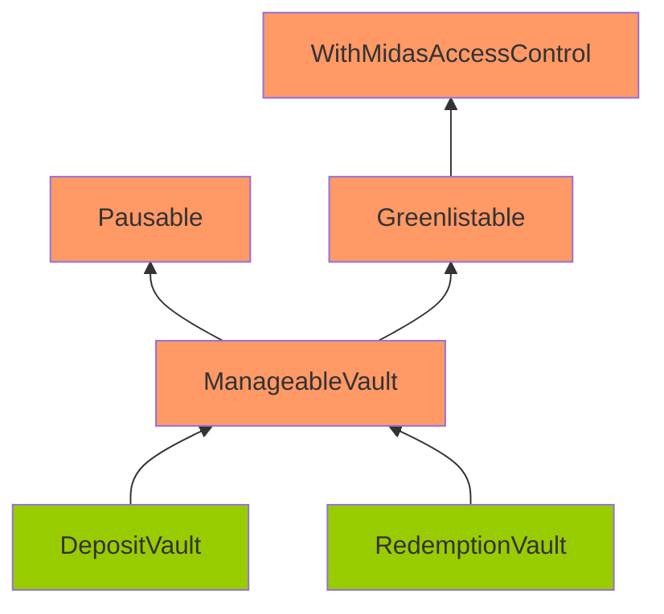
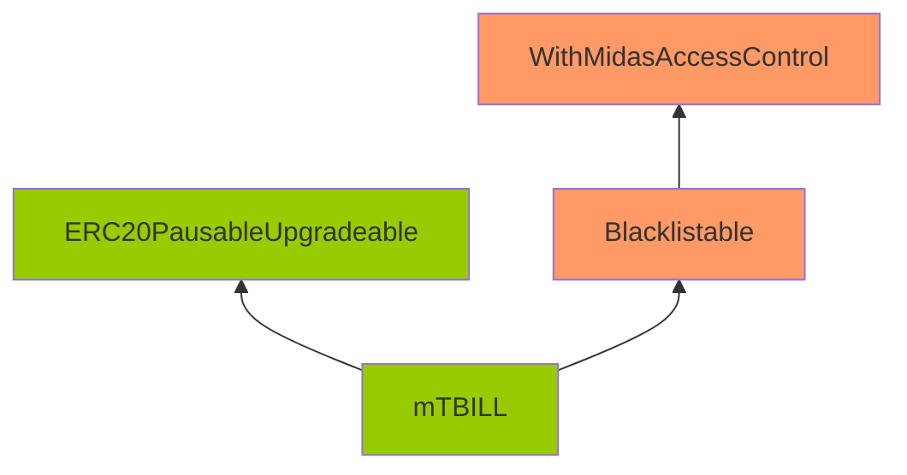

# Issue H-1: Malicious users can bypass the blacklist. 

Source: https://github.com/sherlock-audit/2024-05-midas-judging/issues/9 

The protocol has acknowledged this issue.

## Found by 
0xloscar01, Drynooo, PNS, blutorque, deepkin, den\_sosnovskyi, recursiveEth, wildflowerzx
## Summary
The protocol sets the blacklist through roles, and users can bypass the blacklist through the [renounceRole function](https://github.com/OpenZeppelin/openzeppelin-contracts-upgradeable/blob/f6febd79e2a3a17e26969dd0d450c6ebd64bf459/contracts/access/AccessControlUpgradeable.sol#L186-L190).

## Vulnerability Detail
[mTBILL does not allow blacklisted users to transfer funds.](https://github.com/sherlock-audit/2024-05-midas/blob/a4a3cc23bb891913ce44665a4cdea9f5c1190f6c/midas-contracts/contracts/mTBILL.sol#L90-L102)
```solidity
    function _beforeTokenTransfer(
        address from,
        address to,
        uint256 amount
    )
        internal
        virtual
        override(ERC20PausableUpgradeable)
        onlyNotBlacklisted(from)
        onlyNotBlacklisted(to)
    {
        ERC20PausableUpgradeable._beforeTokenTransfer(from, to, amount);
    }
```

But it is implemented in the form of giving [BLACKLISTED_ROLE.](https://github.com/sherlock-audit/2024-05-midas/blob/a4a3cc23bb891913ce44665a4cdea9f5c1190f6c/midas-contracts/contracts/access/Blacklistable.sol#L38-L42)
```solidity
    function _onlyNotBlacklisted(address account)
        private
        view
        onlyNotRole(BLACKLISTED_ROLE, account)
    {}
```

The AccessControlUpgradeable contract has a [renounceRole function](https://github.com/OpenZeppelin/openzeppelin-contracts-upgradeable/blob/f6febd79e2a3a17e26969dd0d450c6ebd64bf459/contracts/access/AccessControlUpgradeable.sol#L186-L190), through which users can give up their BLACKLISTED_ROLE, thereby bypassing the blacklist.
```solidity
    function renounceRole(bytes32 role, address account) public virtual override {
        require(account == _msgSender(), "AccessControl: can only renounce roles for self");

        _revokeRole(role, account);
    }
```

## Impact
Malicious users can bypass the blacklist.

## Code Snippet
```solidity
    function _beforeTokenTransfer(
        address from,
        address to,
        uint256 amount
    )
        internal
        virtual
        override(ERC20PausableUpgradeable)
        onlyNotBlacklisted(from)
        onlyNotBlacklisted(to)
    {
        ERC20PausableUpgradeable._beforeTokenTransfer(from, to, amount);
    }
```

## Tool used

Manual Review

## Recommendation
It is recommended not to use roles to implement blacklists.


## Discussion

**pkqs90**

Nice issue. I missed the escalation period but still want to make a comment - should this therotically be medium instead of high, since it won't cause a direct loss of funds or non-material losses?

**amankakar**

> Nice issue. I missed the escalation period but still want to make a comment - should this therotically be medium instead of high, since it won't cause a direct loss of funds or non-material losses?

Although i have missed this finding But I think the High is appropriate because the user can easily bypass the blacklist status.

**blutorque**

I think this is more severe, considering the mTBill can immediately be traded in a secondary market(such as Morpho), which already hold ~[30%](https://etherscan.io/token/tokenholderchart/0xDD629E5241CbC5919847783e6C96B2De4754e438) of mTBill supply.

# Issue M-1: Corruptible Upgradability Pattern 

Source: https://github.com/sherlock-audit/2024-05-midas-judging/issues/109 

## Found by 
0xb0k0, 0xjarix, Kalogerone, PNS, ZdravkoHr., charles\_\_cheerful, meltedblocks, nfmelendez, pkqs90, tpiliposian, yovchev\_yoan

## Summary

Storage of DepositVault/RedemptionVault/mTBILL contracts might be corrupted during an upgrade.

## Vulnerability Detail

Following are the inheritance of the DepositVault/RedemptionVault/mTBILL contracts.

Note: The contracts highlighted in Orange mean that there are no gap slots defined. The contracts highlighted in Green mean that gap slots have been defined





The DepositVault/RedemptionVault/mTBILL contracts are meant to be upgradeable. However, it inherits contracts that are not upgrade-safe.

The gap storage has been implemented on the DepositVault/RedemptionVault/mTBILL/ERC20PausableUpgradeable.

However, no gap storage is implemented on ManageableVault/Pausable/Greenlistable/Blacklistable/WithMidasAccessControl. Among these contracts, ManageableVault and WithMidasAccessControl are contracts with defined variables (non pure-function), and they should have gaps as well.

Without gaps, adding new storage variables to any of these contracts can potentially overwrite the beginning of the storage layout of the child contract, causing critical misbehaviors in the system.

## Impact

Storage of DepositVault/RedemptionVault/mTBILL contracts might be corrupted during upgrading.

## Code Snippet

- https://github.com/sherlock-audit/2024-05-midas/blob/main/midas-contracts/contracts/abstract/ManageableVault.sol#L24
- https://github.com/sherlock-audit/2024-05-midas/blob/main/midas-contracts/contracts/access/WithMidasAccessControl.sol#L12

## Tool used

Manual review

## Recommendation

Add gaps for non pure-function contracts: ManageableVault and WithMidasAccessControl.


## Discussion

**0xhsp**

Escalate
This issue is at best low severity, gap storage is not a must to have, no gap storage in ManageableVault / WithMidasAccessControl indicates sponsor won't add new variables to these contracts, even if they have to, they can add new variables in the child contracts.

**sherlock-admin3**

> Escalate
> This issue is at best low severity, gap storage is not a must to have, no gap storage in ManageableVault / WithMidasAccessControl indicates sponsor won't add new variables to these contracts, even if they have to, they can add new variables in the child contracts.

You've created a valid escalation!

To remove the escalation from consideration: Delete your comment.

You may delete or edit your escalation comment anytime before the 48-hour escalation window closes. After that, the escalation becomes final.

**MxAxM**

> Escalate This issue is at best low severity, gap storage is not a must to have, no gap storage in ManageableVault / WithMidasAccessControl indicates sponsor won't add new variables to these contracts, even if they have to, they can add new variables in the child contracts.

This contract is supposed to be upgradeable which means storage gap is required 
Also this issue is considered valid at previous sherlock contests, refer to : https://github.com/sherlock-audit/2022-09-notional-judging/issues/64

according to sherlock docs : if the protocol design has a highly complex and branched set of contract inheritance with storage gaps inconsistently applied throughout and the submission clearly describes the necessity of storage gaps it can be considered a valid medium.

**serial-coder**

> This contract is supposed to be upgradeable which means storage gap is required Also this issue is considered valid at previous sherlock contests, refer to : [sherlock-audit/2022-09-notional-judging#64](https://github.com/sherlock-audit/2022-09-notional-judging/issues/64)

But why my issue (https://github.com/sherlock-audit/2023-06-dinari-judging/issues/110) was rejected in the Dinari contest?

This issue is too subjective, IMO. Would like to see the sponsor's perspective.

**MxAxM**

> > This contract is supposed to be upgradeable which means storage gap is required Also this issue is considered valid at previous sherlock contests, refer to : [sherlock-audit/2022-09-notional-judging#64](https://github.com/sherlock-audit/2022-09-notional-judging/issues/64)
> 
> But why my issue ([sherlock-audit/2023-06-dinari-judging#110](https://github.com/sherlock-audit/2023-06-dinari-judging/issues/110)) was rejected in the Dinari contest?
> 
> This issue is too subjective, IMO. Would like to see the sponsor's perspective.

It's an issue if sponsor wants to upgrade the protocol, it's valid since sponsor didn't list this as a known issue 

according to sherlock docs : if the protocol design has a highly complex and branched set of contract inheritance with storage gaps inconsistently applied throughout and the submission clearly describes the necessity of storage gaps it can be considered a valid medium.

**pronobis4**

This may look planned, but there is no linear/simple inheritance here, just a more convoluted tree where many children inherit from the same contracts, so it will be difficult to make changes if the underlying contracts are not prepared properly.
MEDIUM

**sherlock-admin2**

The protocol team fixed this issue in the following PRs/commits:
https://github.com/RedDuck-Software/midas-contracts/pull/47


**WangSecurity**

I agree with the Lead Judge here. Let's look at the complete rule:

> Use of Storage gaps: Simple contracts with one of the parent contract not implementing storage gaps are considered low/informational.
Exception: However, if the protocol design has a highly complex and branched set of contract inheritance with storage gaps inconsistently applied throughout and the submission clearly describes the necessity of storage gaps it can be considered a valid medium. [Example](https://github.com/sherlock-audit/2022-09-notional-judging/issues/64)

As we see it's not one of the parent contract not implementing storage gaps and the submission clearly explained the necessity of storage gaps here. But, I understand the rule is quite vague, we'll work on it.

Planning to reject the escalation and leave the issue as it is.

**WangSecurity**

Result:
Medium
Has duplicates

**sherlock-admin4**

Escalations have been resolved successfully!

Escalation status:
- [0xhsp](https://github.com/sherlock-audit/2024-05-midas-judging/issues/109/#issuecomment-2155883984): rejected

# Issue M-2: DEPOSIT_VAULT_ADMIN_ROLE/REDEMPTION_VAULT_ADMIN_ROLE have larger permission than expected: they shouldn't be able to pause vaults 

Source: https://github.com/sherlock-audit/2024-05-midas-judging/issues/112 

The protocol has acknowledged this issue.

## Found by 
Afriaudit, pkqs90
## Summary

The accessibility of DEPOSIT_VAULT_ADMIN_ROLE and REDEMPTION_VAULT_ADMIN_ROLE has larger permission than what the contest readme claims: they can pause the vault and stop users from depositing/redeeming.

## Vulnerability Detail

According to the contest readme:

- `DEPOSIT_VAULT_ADMIN_ROLE` has the role of `Handles freeFromMinDeposit, setMinAmountToDeposit, withdrawToken, addPaymentToken, removePaymentToken in DepositVault`.
- `REDEMPTION_VAULT_ADMIN_ROLE` has the role of `Handles withdrawToken, addPaymentToken, removePaymentToken in RedemptionVault`.

However, these two roles are also capable of pausing the depositVault/redemptionVault, which is unexpected.

https://github.com/sherlock-audit/2024-05-midas/blob/main/midas-contracts/contracts/access/Pausable.sol#L18-L38
```solidity
    modifier onlyPauseAdmin() {
>       _onlyRole(pauseAdminRole(), msg.sender);
        _;
    }

    /**
     * @dev upgradeable pattern contract`s initializer
     * @param _accessControl MidasAccessControl contract address
     */
    // solhint-disable-next-line func-name-mixedcase
    function __Pausable_init(address _accessControl) internal onlyInitializing {
        __WithMidasAccessControl_init(_accessControl);
    }

    function pause() external onlyPauseAdmin {
        _pause();
    }

    function unpause() external onlyPauseAdmin {
        _unpause();
    }
```

https://github.com/sherlock-audit/2024-05-midas/blob/main/midas-contracts/contracts/abstract/ManageableVault.sol#L139-L141
```solidity
    function pauseAdminRole() public view override returns (bytes32) {
        return vaultRole();
    }
```

https://github.com/sherlock-audit/2024-05-midas/blob/main/midas-contracts/contracts/DepositVault.sol
```solidity
    function vaultRole() public pure override returns (bytes32) {
        return DEPOSIT_VAULT_ADMIN_ROLE;
    }
```

https://github.com/sherlock-audit/2024-05-midas/blob/main/midas-contracts/contracts/RedemptionVault.sol
```solidity
    function vaultRole() public pure override returns (bytes32) {
        return REDEMPTION_VAULT_ADMIN_ROLE;
    }
```

## Impact

The two roles DEPOSIT_VAULT_ADMIN_ROLE/REDEMPTION_VAULT_ADMIN_ROLE have larger permission than they are expected to have.

## Code Snippet

- https://github.com/sherlock-audit/2024-05-midas/blob/main/midas-contracts/contracts/abstract/ManageableVault.sol#L139-L141
- https://github.com/sherlock-audit/2024-05-midas/blob/main/midas-contracts/contracts/access/Pausable.sol#L18-L38

## Tool used

Manual review

## Recommendation

Remove the pausability permission for DEPOSIT_VAULT_ADMIN_ROLE and REDEMPTION_VAULT_ADMIN_ROLE.


## Discussion

**nevillehuang**

Escalate, this issue has no impact given all listed roles are trusted except `GREENLISTED_ROLE` and `BLACKLISTED_ROLE`. Notice that in `MidasAccessControl.sol` all roles are delegated to the `admin`, so in fact `admin` has the power of all trusted roles. The contest READ.ME simply states the role purpose, not the only permission it can perform, but the code logic indicates the `admin` role can perform all the trusted actions.

```solidity
    function _setupRoles() private {
        address admin = msg.sender;

        _setupRole(DEFAULT_ADMIN_ROLE, admin);

        _setupRole(DEPOSIT_VAULT_ADMIN_ROLE, admin);
        _setupRole(REDEMPTION_VAULT_ADMIN_ROLE, admin);

        _setRoleAdmin(BLACKLISTED_ROLE, BLACKLIST_OPERATOR_ROLE);
        _setRoleAdmin(GREENLISTED_ROLE, GREENLIST_OPERATOR_ROLE);

        _setupRole(GREENLIST_OPERATOR_ROLE, admin);
        _setupRole(BLACKLIST_OPERATOR_ROLE, admin);

        _setupRole(M_TBILL_MINT_OPERATOR_ROLE, admin);
        _setupRole(M_TBILL_BURN_OPERATOR_ROLE, admin);
        _setupRole(M_TBILL_PAUSE_OPERATOR_ROLE, admin);
```


**sherlock-admin3**

> Escalate, this issue has no impact given all listed roles are trusted except `GREENLISTED_ROLE` and `BLACKLISTED_ROLE`. Notice that in `MidasAccessControl.sol` all roles are delegated to the `admin`, so in fact `admin` has the power of all trusted roles. The contest READ.ME simply states the role purpose, not the only permission it can perform, but the code logic indicates the `admin` role can perform all the trusted actions.
> 
> ```solidity
>     function _setupRoles() private {
>         address admin = msg.sender;
> 
>         _setupRole(DEFAULT_ADMIN_ROLE, admin);
> 
>         _setupRole(DEPOSIT_VAULT_ADMIN_ROLE, admin);
>         _setupRole(REDEMPTION_VAULT_ADMIN_ROLE, admin);
> 
>         _setRoleAdmin(BLACKLISTED_ROLE, BLACKLIST_OPERATOR_ROLE);
>         _setRoleAdmin(GREENLISTED_ROLE, GREENLIST_OPERATOR_ROLE);
> 
>         _setupRole(GREENLIST_OPERATOR_ROLE, admin);
>         _setupRole(BLACKLIST_OPERATOR_ROLE, admin);
> 
>         _setupRole(M_TBILL_MINT_OPERATOR_ROLE, admin);
>         _setupRole(M_TBILL_BURN_OPERATOR_ROLE, admin);
>         _setupRole(M_TBILL_PAUSE_OPERATOR_ROLE, admin);
> ```
> 

You've created a valid escalation!

To remove the escalation from consideration: Delete your comment.

You may delete or edit your escalation comment anytime before the 48-hour escalation window closes. After that, the escalation becomes final.

**pronobis4**

I agree with escalation, these are trusted roles.

**amankakar**

I think it is about the difference between the readMe and the code. that's why it should be accepted.
reamMe  does not stated that the `DEPOSIT_VAULT_ADMIN_ROLE/REDEMPTION_VAULT_ADMIN_ROLE` can pause/unpasue the deposits/redemption.

**Afriaudit**

The entire protocol uses a role-based access control to manage permissions, a significant part of the code base is ensuring that each role can only execute the functions they are specifically permitted to, and nothing more or less. The README specifically asked. ''provide a more comprehensive description of what a role can and can't do/impact'', a comprehensive list was provided and roles of `DEPOSIT_VAULT_ADMIN_ROLE/REDEMPTION_VAULT_ADMIN_ROLE` didn't include pausing deposits and redeem.

The README was also asked;
"For permissioned functions, please list all checks and requirements that will be made before calling the function."
and the response is:
 "onlyRole() - Checks if the permissioned function is being called by an address with its respective admin role " This is to underscore that each admin Is only supposed to execute only functions they are permitted to. functions which are stated on the readme.

The statement made here by @nevillehuang  "The contest READ.ME simply states the role purpose, not the only permission it can perform, but the code logic indicates the admin role can perform all the trusted actions." Is actually inaccurate here is why:

1. "admin role can perform all the trusted actions": Its only the default admin that has all functions according to the code logic after launch. Its because its literarily the admin by default and according to the README default admin is expected to Grants and revokes roles even to other admins. The code even has a logic implementation for this. showing that the admins of each role is expected to change from default admin after launch.

2. "The contest READ.ME simply states the role purpose, not the only permission it can perform": I dont agree with this as the README shows a comprehensive list of all permissioned functions and exactly who is to call them except for this particular role. 
From all being said it's reasonable to conclude that admins are trusted to manage only the roles they are specifically authorized to control, and nothing beyond that. The whole point of the role-based access control will be pointless if an admin role can just arbitrarily call a function outside its own permissioned function because it trusted with its own permitted roles.

I think I have made my point here for the sherlock judge to make final verdict. 

**MxAxM**

> Escalate, this issue has no impact given all listed roles are trusted except `GREENLISTED_ROLE` and `BLACKLISTED_ROLE`. Notice that in `MidasAccessControl.sol` all roles are delegated to the `admin`, so in fact `admin` has the power of all trusted roles. The contest READ.ME simply states the role purpose, not the only permission it can perform, but the code logic indicates the `admin` role can perform all the trusted actions.
> 
> ```solidity
>     function _setupRoles() private {
>         address admin = msg.sender;
> 
>         _setupRole(DEFAULT_ADMIN_ROLE, admin);
> 
>         _setupRole(DEPOSIT_VAULT_ADMIN_ROLE, admin);
>         _setupRole(REDEMPTION_VAULT_ADMIN_ROLE, admin);
> 
>         _setRoleAdmin(BLACKLISTED_ROLE, BLACKLIST_OPERATOR_ROLE);
>         _setRoleAdmin(GREENLISTED_ROLE, GREENLIST_OPERATOR_ROLE);
> 
>         _setupRole(GREENLIST_OPERATOR_ROLE, admin);
>         _setupRole(BLACKLIST_OPERATOR_ROLE, admin);
> 
>         _setupRole(M_TBILL_MINT_OPERATOR_ROLE, admin);
>         _setupRole(M_TBILL_BURN_OPERATOR_ROLE, admin);
>         _setupRole(M_TBILL_PAUSE_OPERATOR_ROLE, admin);
> ```

I assumed they're different roles with different permissions and they shouldn't have more permission than what described in docs, also saying admins are trusted means they won't perform malicious actions by having defined permissions and it doesn't mean they can perform actions that they don't have permission to 

**CarlosAlegreUr**

> a significant part of the code base is ensuring that each role can only execute the functions they are specifically permitted to, and nothing more or less

Just to add another point of view. I would say this issue is valid or not depending on the definition of `TRUSTED` in Sherlock. As @MxAxM defined it here:

```text
trusted means they won't perform malicious actions by having defined permissions and it doesn't mean they can perform actions that they don't have permission to
```

Then I think it is valid. Personally I thought of `TRUSTED` as: Someone who whatever it can do it doesnt matter because it is assumed it will never do something malicious. Thus when auditing I didnt even check what `TRUSTED` roles could or could not do. I would appreciate a clear definition of what a `TRUSTED` actor is in Sherlock, could not find it on their docs.

To conclude, if the definition is the one said by @MxAxM , I think the issue is valid, if it is the one I said, I think it is invalid.

**pronobis4**

All this will not change the fact that the admin is TRUSTED, he cannot be treated as someone who will do something bad, which reduces the impact of this "issue".

>''provide a more comprehensive description of what a role can and can't do/impact''

Just as it is not written that "he can pause", it is also not written that "he cannot pause".

If the project contains a hierarchy of permissions, then each role would have to list all the roles it inherits, which would be crazy.

**Afriaudit**

Just to add to the comments I made earlier

In the README "Additional audit information" section, sponsor specifically mentioned that one of the attack vectors they would want watson's to look out for is ensuring roles work properly. Which means verify that only authorized roles can execute their respective functions. Which also goes to underscore the fact that each admin should only be able to execute their specified functions as outlined in the README.

The list of what a role can do was clearly stated and its logical to assume what was not in the list of what a role can do are things it can't do. There is no point to having a hierarchy of permissions. every role has its own explicit permissioned function. 

**WangSecurity**

As said above, indeed, the Additional audit information specifically asks Watsons to see if all the roles work properly. Hence, I believe the question about the roles gave a full explanation what each role should do and they should be able to do nothing less or more.

Yes, they're TRUSTED and we have to assume they won't harm the protocol in any way. But, I don't believe this issue is about completing malicious actions and the report doesn't talk about it. The problem is that under Sherlock's rules, if there is an issue breaking the statement/invariant explicitly mentioned in the README, it will be assigned Medium severity, regardless of the impact. Hence, I believe this issue has to stay valid.

Planning to reject the escalation and leave the issue as it is.

**Afriaudit**

Also #83 is not a duplicate of this issue but an independent issue on its own that is worth looking into

**blutorque**

Hey @WangSecurity, this finding says , "High permission role can pause vaults". And if they could do so, there is nothing wrong to assume `mint`/`burn` actions can also be performed irrespective of your user action. 

I specifically want to highlight issue [F-2023-0290](https://2732961456-files.gitbook.io/~/files/v0/b/gitbook-x-prod.appspot.com/o/spaces%2FsPjk0ggBxEJCCnVFFkDR%2Fuploads%2F38N1bo36K8FLriRrPDXb%2FHacken_Midas_%5BSCA%5D%20Midas_Vault_Dec2023_P-2023-076_1_20240118%2016_22.pdf?alt=media&token=2c58f6f7-889e-4c64-ac84-35bad59eb51a), which represent the same issue as this one, in one of previous audit report of Midas. 

Also, Readme, 

> A note for Sherlock Watsons: Anything in the following section is considered a known issue and will be inelgible for rewards.
> 
> Our most recent audit can be found [here](https://2732961456-files.gitbook.io/~/files/v0/b/gitbook-x-prod.appspot.com/o/spaces%2FsPjk0ggBxEJCCnVFFkDR%2Fuploads%2F38N1bo36K8FLriRrPDXb%2FHacken_Midas_%5BSCA%5D%20Midas_Vault_Dec2023_P-2023-076_1_20240118%2016_22.pdf?alt=media&token=2c58f6f7-889e-4c64-ac84-35bad59eb51a).

**WangSecurity**

Thank you for sharing, but I don't see how this issue is connected to this report. The issue from Hacken is about the Burner role easily accessing user's funds, this report is about several roles having permission for functions they shouldn't have.

Hence, the decision remains the same. Planning to reject the escalation and leave the issue as it is.

**nevillehuang**

@WangSecurity The `DEFAULT_ADMIN_ROLE` which is set as the `admin` inherently holds the right to change these admins at any time. Is this really a security issue that goes against the contest details? The admin will likely never renounce this role.

Anyways feel free to resolve this issue will respect your decision

**Afriaudit**

The README(contest details) asked watsons to ensure the roles work properly. The only way watson can do this is to check each role against it permissioned function as described by the contest details, And this issue is describing a role which has access to a function its not permitted by the README. This indeed goes against the contest details.

**WangSecurity**

@nevillehuang fair point, but still it doesn't change the fact that in fact DEPOSIT_VAULT_ADMIN_ROLE/REDEMPTIOJ_VAULT_ADMIN_ROLE have more rights then stated in the README. And README specifically asked to check the roles being set properly. I agree it's low, but under rules, since it breaks assumption from the README, it indeed should be Medium.

The decision remains the same, reject the escalation and leave the issue as it is.

**WangSecurity**

Result:
Medium
Has duplicates

**sherlock-admin4**

Escalations have been resolved successfully!

Escalation status:
- [nevillehuang](https://github.com/sherlock-audit/2024-05-midas-judging/issues/112/#issuecomment-2155452077): rejected

