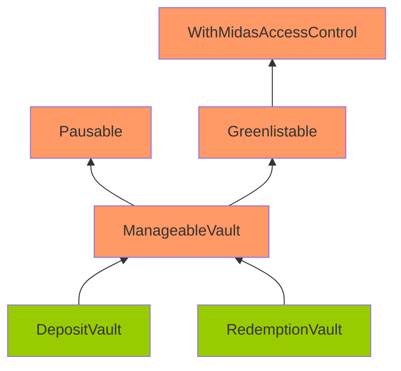
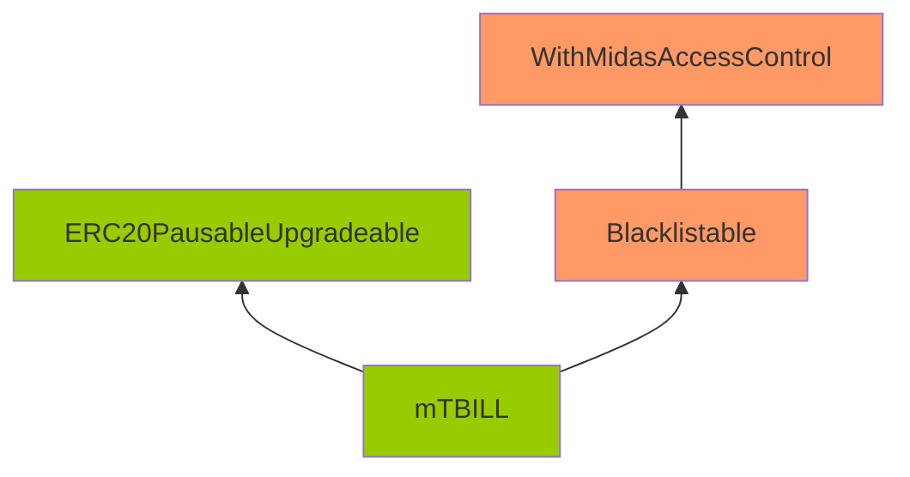

# Issue H-1: Malicious users can bypass the blacklist. 

Source: https://github.com/sherlock-audit/2024-05-midas-judging/issues/9 

## Found by 
0xloscar01, Drynooo, PNS, blutorque, deepkin, den\_sosnovskyi, recursiveEth, wildflowerzx
## Summary
The protocol sets the blacklist through roles, and users can bypass the blacklist through the [renounceRole function](https://github.com/OpenZeppelin/openzeppelin-contracts-upgradeable/blob/f6febd79e2a3a17e26969dd0d450c6ebd64bf459/contracts/access/AccessControlUpgradeable.sol#L186-L190).

## Vulnerability Detail
[mTBILL does not allow blacklisted users to transfer funds.](https://github.com/sherlock-audit/2024-05-midas/blob/a4a3cc23bb891913ce44665a4cdea9f5c1190f6c/midas-contracts/contracts/mTBILL.sol#L90-L102)
```solidity
    function _beforeTokenTransfer(
        address from,
        address to,
        uint256 amount
    )
        internal
        virtual
        override(ERC20PausableUpgradeable)
        onlyNotBlacklisted(from)
        onlyNotBlacklisted(to)
    {
        ERC20PausableUpgradeable._beforeTokenTransfer(from, to, amount);
    }
```

But it is implemented in the form of giving [BLACKLISTED_ROLE.](https://github.com/sherlock-audit/2024-05-midas/blob/a4a3cc23bb891913ce44665a4cdea9f5c1190f6c/midas-contracts/contracts/access/Blacklistable.sol#L38-L42)
```solidity
    function _onlyNotBlacklisted(address account)
        private
        view
        onlyNotRole(BLACKLISTED_ROLE, account)
    {}
```

The AccessControlUpgradeable contract has a [renounceRole function](https://github.com/OpenZeppelin/openzeppelin-contracts-upgradeable/blob/f6febd79e2a3a17e26969dd0d450c6ebd64bf459/contracts/access/AccessControlUpgradeable.sol#L186-L190), through which users can give up their BLACKLISTED_ROLE, thereby bypassing the blacklist.
```solidity
    function renounceRole(bytes32 role, address account) public virtual override {
        require(account == _msgSender(), "AccessControl: can only renounce roles for self");

        _revokeRole(role, account);
    }
```

## Impact
Malicious users can bypass the blacklist.

## Code Snippet
```solidity
    function _beforeTokenTransfer(
        address from,
        address to,
        uint256 amount
    )
        internal
        virtual
        override(ERC20PausableUpgradeable)
        onlyNotBlacklisted(from)
        onlyNotBlacklisted(to)
    {
        ERC20PausableUpgradeable._beforeTokenTransfer(from, to, amount);
    }
```

## Tool used

Manual Review

## Recommendation
It is recommended not to use roles to implement blacklists.

# Issue M-1: `M_TBILL_BURN_OPERATOR_ROLE` cannot burn `mTBILL` tokens from users who are blacklisted. 

Source: https://github.com/sherlock-audit/2024-05-midas-judging/issues/107 

## Found by 
Kirkeelee, Timenov, blutorque, cocacola, meltedblocks, pkqs90, y4y

## Summary

`M_TBILL_BURN_OPERATOR_ROLE` cannot burn `mTBILL` tokens from users who are blacklisted.

## Vulnerability Detail

The `burn()` function of `mTBILL` is called by the `M_TBILL_BURN_OPERATOR_ROLE` role, it should be able to burn tokens from any user. Quote the protocol team: *burning is our way to seize assets if necessary.*

However, since `_beforeTokenTransfer` is also called during the internal `_burn()` function, users that are blacklisted would not be able to be burned.

https://github.com/sherlock-audit/2024-05-midas/blob/main/midas-contracts/contracts/mTBILL.sol#L90-L102
```solidity
    function burn(address from, uint256 amount)
        external
        onlyRole(M_TBILL_BURN_OPERATOR_ROLE, msg.sender)
    {
        _burn(from, amount);
    }

    ...

    function _beforeTokenTransfer(
        address from,
        address to,
        uint256 amount
    )
        internal
        virtual
        override(ERC20PausableUpgradeable)
        onlyNotBlacklisted(from)
        onlyNotBlacklisted(to)
    {
        ERC20PausableUpgradeable._beforeTokenTransfer(from, to, amount);
    }
```

https://github.com/OpenZeppelin/openzeppelin-contracts-upgradeable/blob/v4.9.0/contracts/token/ERC20/ERC20Upgradeable.sol#L282-L298
```solidity
    function _burn(address account, uint256 amount) internal virtual {
        require(account != address(0), "ERC20: burn from the zero address");

>       _beforeTokenTransfer(account, address(0), amount);

        uint256 accountBalance = _balances[account];
        require(accountBalance >= amount, "ERC20: burn amount exceeds balance");
        unchecked {
            _balances[account] = accountBalance - amount;
            // Overflow not possible: amount <= accountBalance <= totalSupply.
            _totalSupply -= amount;
        }

        emit Transfer(account, address(0), amount);

        _afterTokenTransfer(account, address(0), amount);
    }
```

## Impact

`M_TBILL_BURN_OPERATOR_ROLE` cannot burn `mTBILL` tokens from users who are blacklisted.

## Code Snippet

- https://github.com/sherlock-audit/2024-05-midas/blob/main/midas-contracts/contracts/mTBILL.sol#L90-L102
- https://github.com/OpenZeppelin/openzeppelin-contracts-upgradeable/blob/v4.9.0/contracts/token/ERC20/ERC20Upgradeable.sol#L282-L298

## Tool used

Manual review

## Recommendation

Add a manual check if `to` address is 0, skip the blacklist check for `from` address.

# Issue M-2: Rounding direction for the amount of stablecoin user deposit is incorrect 

Source: https://github.com/sherlock-audit/2024-05-midas-judging/issues/108 

## Found by 
0xb0k0, Gowtham\_Ponnana, Kirkeelee, KiroBrejka, T\_F\_E, Tri-pathi, ZdravkoHr., deepkin, krot-0025, meltedblocks, niluk, petarP1998, petro1912, pkqs90, samuraii77, turvec

## Summary

The rounding direction for the amount of stablecoin user deposit is incorrect. This would cause the deposit amount to be slightly larger than what the user actually deposited, which is a loss for the protocol.

## Vulnerability Detail

During the deposit process, the user specifies the `amountUsdIn` (in 18 decimals) that he would like to deposit. This amount of mTBILL is minted to the user in the future.

User should transfer the equivalent amount of stablecoin to the receiver. The issue here is when calculating the amount of stablecoin to be transferred, the rounding direction should be up instead of down.

Take USDC as an example. If a user passes `amountUsdIn` as `1e12-1`, the actual amount of USDC that would be sent is `(1e12-1) / 1e12` which would be 0, which means users can get `1e12-1` mTBILL tokens for free.

Notice that though this is a very small amount of money (1e-6 USD), if the number of deposits is large enough, this would become large. Also, from the protocol's perspective, this dust amount of money should be charged to the users, or else it may accumulate in the protocol and reach a non-dust value.

https://github.com/sherlock-audit/2024-05-midas/blob/main/midas-contracts/contracts/DepositVault.sol#L91C1-L112C6
```solidity
    function deposit(address tokenIn, uint256 amountUsdIn)
        external
        onlyGreenlisted(msg.sender)
        whenNotPaused
    {
        address user = msg.sender;

        _requireTokenExists(tokenIn);

        lastRequestId.increment();
        uint256 requestId = lastRequestId.current();

        if (!isFreeFromMinDeposit[user]) {
            _validateAmountUsdIn(user, amountUsdIn);
        }
        require(amountUsdIn > 0, "DV: invalid amount");

        totalDeposited[user] += amountUsdIn;
>       _tokenTransferFromUser(tokenIn, amountUsdIn);

        emit Deposit(requestId, user, tokenIn, amountUsdIn);
    }
```

https://github.com/sherlock-audit/2024-05-midas/blob/main/midas-contracts/contracts/abstract/ManageableVault.sol#L151C1-L157C6
```solidity
    function _tokenTransferFromUser(address token, uint256 amount) internal {
        IERC20(token).safeTransferFrom(
            msg.sender,
            tokensReceiver,
>           amount.convertFromBase18(_tokenDecimals(token))
        );
    }
```


https://github.com/sherlock-audit/2024-05-midas/blob/main/midas-contracts/contracts/libraries/DecimalsCorrectionLibrary.sol#L18C1-L54C6
```solidity
    function convert(
        uint256 originalAmount,
        uint256 originalDecimals,
        uint256 decidedDecimals
    ) internal pure returns (uint256) {
        if (originalAmount == 0) return 0;
        if (originalDecimals == decidedDecimals) return originalAmount;

        uint256 adjustedAmount;

        if (originalDecimals > decidedDecimals) {
>           adjustedAmount =
>               originalAmount /
>               (10**(originalDecimals - decidedDecimals));
        } else {
            adjustedAmount =
                originalAmount *
                (10**(decidedDecimals - originalDecimals));
        }

        return adjustedAmount;
    }

    /**
     * @dev converts `originalAmount` with decimals 18 into
     * amount with `decidedDecimals`
     * @param originalAmount amount to convert
     * @param decidedDecimals decimals for the output amount
     * @return amount converted amount with `decidedDecimals`
     */
    function convertFromBase18(uint256 originalAmount, uint256 decidedDecimals)
        internal
        pure
        returns (uint256)
    {
        return convert(originalAmount, 18, decidedDecimals);
    }
```

## Impact

The protocol would lose dust amount of mTBILL for each deposit, which may accumulate to be a non-dust value.

## Code Snippet

- https://github.com/sherlock-audit/2024-05-midas/blob/main/midas-contracts/contracts/DepositVault.sol#L91C1-L112C6
- https://github.com/sherlock-audit/2024-05-midas/blob/main/midas-contracts/contracts/abstract/ManageableVault.sol#L151C1-L157C6
- https://github.com/sherlock-audit/2024-05-midas/blob/main/midas-contracts/contracts/libraries/DecimalsCorrectionLibrary.sol#L18C1-L54C6

## Tool used

Manual review

## Recommendation

Round up the user transfer for stablecoin instead of rounding down.

# Issue M-3: Corruptible Upgradability Pattern 

Source: https://github.com/sherlock-audit/2024-05-midas-judging/issues/109 

## Found by 
0xb0k0, 0xjarix, Kalogerone, PNS, ZdravkoHr., charles\_\_cheerful, meltedblocks, nfmelendez, pkqs90, tpiliposian, yovchev\_yoan

## Summary

Storage of DepositVault/RedemptionVault/mTBILL contracts might be corrupted during an upgrade.

## Vulnerability Detail

Following are the inheritance of the DepositVault/RedemptionVault/mTBILL contracts.

Note: The contracts highlighted in Orange mean that there are no gap slots defined. The contracts highlighted in Green mean that gap slots have been defined





The DepositVault/RedemptionVault/mTBILL contracts are meant to be upgradeable. However, it inherits contracts that are not upgrade-safe.

The gap storage has been implemented on the DepositVault/RedemptionVault/mTBILL/ERC20PausableUpgradeable.

However, no gap storage is implemented on ManageableVault/Pausable/Greenlistable/Blacklistable/WithMidasAccessControl. Among these contracts, ManageableVault and WithMidasAccessControl are contracts with defined variables (non pure-function), and they should have gaps as well.

Without gaps, adding new storage variables to any of these contracts can potentially overwrite the beginning of the storage layout of the child contract, causing critical misbehaviors in the system.

## Impact

Storage of DepositVault/RedemptionVault/mTBILL contracts might be corrupted during upgrading.

## Code Snippet

- https://github.com/sherlock-audit/2024-05-midas/blob/main/midas-contracts/contracts/abstract/ManageableVault.sol#L24
- https://github.com/sherlock-audit/2024-05-midas/blob/main/midas-contracts/contracts/access/WithMidasAccessControl.sol#L12

## Tool used

Manual review

## Recommendation

Add gaps for non pure-function contracts: ManageableVault and WithMidasAccessControl.

# Issue M-4: Chainlink datafeed may be stale and incorrect 

Source: https://github.com/sherlock-audit/2024-05-midas-judging/issues/110 

## Found by 
0xhacksmithh, 14si2o\_Flint, 4rdiii, Audinarey, Bigsam, Josh4324, KiroBrejka, MohammedRizwan, Naresh, Tri-pathi, ZdravkoHr., aman, araj, aslanbek, blutorque, carlitox477, charles\_\_cheerful, cocacola, coffiasd, goluu, h2134, nisedo, pkqs90, sandy, serial-coder, tpiliposian, utsav, y0ng0p3

## Summary

There are two issues related to the chainlink datafeed:

1. The current datafeed uses 3 day for staleness check, but the update period for EUR/USD on arbitrum is 1 hour.
2. It does not consider the builtin circuit breaker.

## Vulnerability Detail

### 1. Staleness check

First let's talk about the staleness check issue.

This protocol is deployed on both Ethereum and Arbitrum, and the datafeed is used for EUR/USD and IB01/USD. According to the readme, the current staleness check is set to 3 days because IB01/USD *will only be updated during defined market hours (weekends and holidays excluded), so we assume the price is only stale if more than three days have passed*.

However, this is not how chainlink works. Even though the market price is only updated during weekdays, the price is still updated every X seconds **on-chain**, regardless if the market price is updated or not.

We can take EUR/USD on Arbitrum for an example: https://data.chain.link/feeds/arbitrum/mainnet/eur-usd. If we hover on "Trigger parameters", we can see it says "*A new answer is written when the offchain data moves more than the deviation threshold or 3600 seconds have passed since the last answer was written onchain*".

Just to be sure, we can read the `getRoundData()` function for its aggregator https://arbiscan.io/address/0xA14d53bC1F1c0F31B4aA3BD109344E5009051a84#readContract. Pass 18446744073709580880 and 18446744073709580881 as `_roundId` and we can see the update timestamp is 1716631204 (GMT, Saturday, May 25, 2024 10:00:04 AM) and 1716634806 (GMT, Saturday, May 25, 2024 11:00:06 AM). Notice the time difference is 1 hour and it is on a weekend.

Now we have proved that the aggregator is updated every hour on Arbitrum for EUR/USD, having a hardcoded 3 days staleness check is simply too long.

### 2. Circuit breaker

Then let's talk about the circuit breaker issue. This is of less impact, but I'd like to bring it up as well.

The EUR/USD aggregator contains a circuit breaker of minAnswer == 0.1, maxAnswer == 100 for EUR/USD on ethereum mainnet. We can check it up by the [aggregator](https://etherscan.io/address/0x02F878A94a1AE1B15705aCD65b5519A46fe3517e#readContract) address in EUR/USD [price feed](https://etherscan.io/address/0xb49f677943BC038e9857d61E7d053CaA2C1734C1#readContract). The minAnswer is 1e7, maxAnswer is 1e10, with 8 decimals.

This means if EUR/USD falls below 0.1 or rises above 100, the price feed would take 0.1 or 100 as the answer, which is unexpected.

The current price is 1.0824, and reaching such limit is unlikely to happen, but it would be nice to have a check for it.

```solidity
    function _getDataInBase18()
        private
        view
        returns (uint80 roundId, uint256 answer)
    {
        uint8 decimals = aggregator.decimals();
        (uint80 _roundId, int256 _answer, , uint256 updatedAt, ) = aggregator
            .latestRoundData();
        require(_answer > 0, "DF: feed is deprecated");
        require(
            // solhint-disable-next-line not-rely-on-time
            block.timestamp - updatedAt <= _HEALTHY_DIFF,
            "DF: feed is unhealthy"
        );
        roundId = _roundId;
        answer = uint256(_answer).convertToBase18(decimals);
    }
```

## Impact

1. Staleness check is too large for EUR/USD pair on arbitrum.
2. There is no handling logic if the prices reaches below minAnswer or above maxAnswer.

Both would cause the incorrect calculation of minimum deposit amount for depositVault.

## Code Snippet

- https://github.com/sherlock-audit/2024-05-midas/blob/main/midas-contracts/contracts/feeds/DataFeed.sol#L64-L80

## Tool used

Manual review

## Recommendation

1. Do not hardcode 3 days as staleness check. Make it a configurable parameter, and set it to 3 hours for EUR/USD on Arbitrum.
2. Introduce a minAnswer and maxAnswer circuit breaker check.

# Issue M-5: DEPOSIT_VAULT_ADMIN_ROLE/REDEMPTION_VAULT_ADMIN_ROLE have larger permission than expected: they shouldn't be able to pause vaults 

Source: https://github.com/sherlock-audit/2024-05-midas-judging/issues/112 

## Found by 
Afriaudit, pkqs90, tpiliposian
## Summary

The accessibility of DEPOSIT_VAULT_ADMIN_ROLE and REDEMPTION_VAULT_ADMIN_ROLE has larger permission than what the contest readme claims: they can pause the vault and stop users from depositing/redeeming.

## Vulnerability Detail

According to the contest readme:

- `DEPOSIT_VAULT_ADMIN_ROLE` has the role of `Handles freeFromMinDeposit, setMinAmountToDeposit, withdrawToken, addPaymentToken, removePaymentToken in DepositVault`.
- `REDEMPTION_VAULT_ADMIN_ROLE` has the role of `Handles withdrawToken, addPaymentToken, removePaymentToken in RedemptionVault`.

However, these two roles are also capable of pausing the depositVault/redemptionVault, which is unexpected.

https://github.com/sherlock-audit/2024-05-midas/blob/main/midas-contracts/contracts/access/Pausable.sol#L18-L38
```solidity
    modifier onlyPauseAdmin() {
>       _onlyRole(pauseAdminRole(), msg.sender);
        _;
    }

    /**
     * @dev upgradeable pattern contract`s initializer
     * @param _accessControl MidasAccessControl contract address
     */
    // solhint-disable-next-line func-name-mixedcase
    function __Pausable_init(address _accessControl) internal onlyInitializing {
        __WithMidasAccessControl_init(_accessControl);
    }

    function pause() external onlyPauseAdmin {
        _pause();
    }

    function unpause() external onlyPauseAdmin {
        _unpause();
    }
```

https://github.com/sherlock-audit/2024-05-midas/blob/main/midas-contracts/contracts/abstract/ManageableVault.sol#L139-L141
```solidity
    function pauseAdminRole() public view override returns (bytes32) {
        return vaultRole();
    }
```

https://github.com/sherlock-audit/2024-05-midas/blob/main/midas-contracts/contracts/DepositVault.sol
```solidity
    function vaultRole() public pure override returns (bytes32) {
        return DEPOSIT_VAULT_ADMIN_ROLE;
    }
```

https://github.com/sherlock-audit/2024-05-midas/blob/main/midas-contracts/contracts/RedemptionVault.sol
```solidity
    function vaultRole() public pure override returns (bytes32) {
        return REDEMPTION_VAULT_ADMIN_ROLE;
    }
```

## Impact

The two roles DEPOSIT_VAULT_ADMIN_ROLE/REDEMPTION_VAULT_ADMIN_ROLE have larger permission than they are expected to have.

## Code Snippet

- https://github.com/sherlock-audit/2024-05-midas/blob/main/midas-contracts/contracts/abstract/ManageableVault.sol#L139-L141
- https://github.com/sherlock-audit/2024-05-midas/blob/main/midas-contracts/contracts/access/Pausable.sol#L18-L38

## Tool used

Manual review

## Recommendation

Remove the pausability permission for DEPOSIT_VAULT_ADMIN_ROLE and REDEMPTION_VAULT_ADMIN_ROLE.

